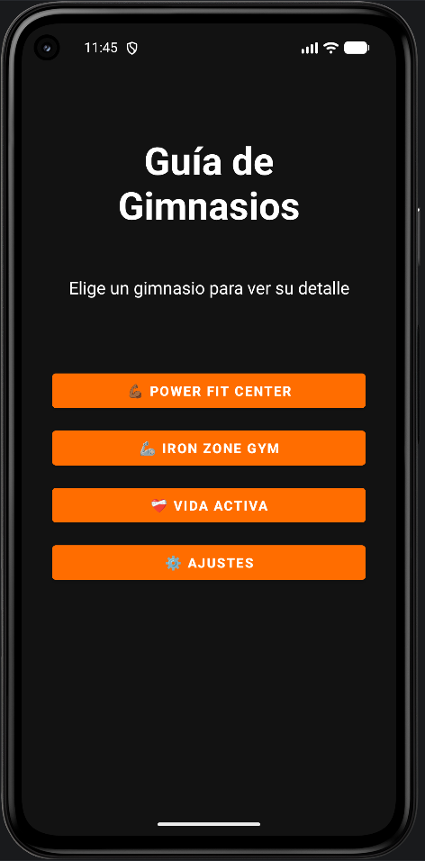
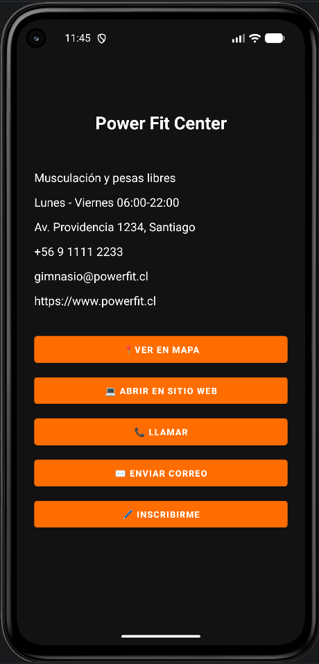
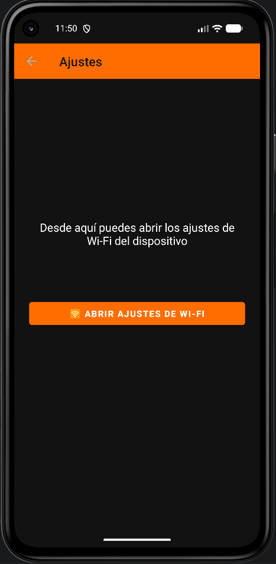
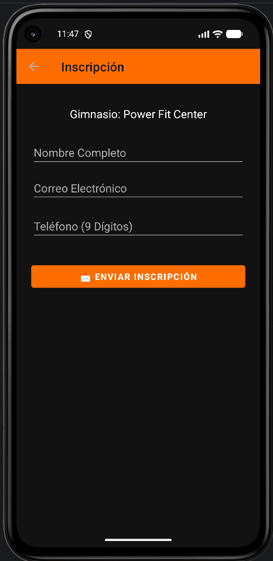
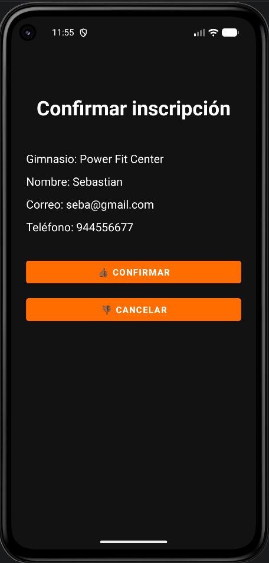

# 🏋️ Guía de Gimnasios

App Android (Java) que muestra una lista de gimnasios, su detalle y permite contactarlos o inscribirse. Desarrollada para el **Prototipo 2** de la asignatura **Programación Android**, para practicar **Intents implícitos y explícitos**.

- 👤 **Autor:** Sebastian
- 📚 **Asignatura:** Programación Android
- 👨‍🏫 **Docente:** Pedro Gatica

---

## 🛠️ Versiones y requisitos

| Elemento | Valor |
|---|---|
| 📦 Paquete | `com.devst.guiadegimnasio` |
| 🔧 Android Gradle Plugin (AGP) | 9.4.0-alpha01 |
| 📱 minSdk | 31 (Android 12) |
| 🎯 targetSdk / compileSdk | 37 |
| ☕ Lenguaje | Java |
| 🧩 AppCompat / Material | 1.8.0 / 1.14.0 |
| 🔢 Versión de la app | 1.0 |

---

## 📸 Capturas

<table>
  <tr>
    <td align="center"><b>Principal</b><br></td>
    <td align="center"><b>Detalle</b><br></td>
    <td align="center"><b>Ajustes</b><br></td>
  </tr>
  <tr>
    <td align="center"><b>Formulario</b><br></td>
    <td align="center"><b>Confirmación</b><br></td>
    <td></td>
  </tr>
</table>

---

## 🔀 Intents implementados (8)

### 🌐 Implícitos (5)

| # | Intent | Acción / URI | Dónde | Cómo probarlo |
|---|---|---|---|---|
| 1 | 📍 Abrir mapa | `ACTION_VIEW` + `geo:0,0?q=<dirección>` | Detalle → **Ver en Mapa** | Entra a un gimnasio y toca el botón: se abre la app de mapas con la dirección. |
| 2 | 💻 Abrir sitio web | `ACTION_VIEW` + `https://...` | Detalle → **Abrir en sitio web** | Toca el botón: se abre el navegador con la web del gimnasio. |
| 3 | 📞 Llamar | `ACTION_DIAL` + `tel:<número>` | Detalle → **Llamar** | Toca el botón: se abre el marcador con el número cargado (no llama solo). |
| 4 | ✉️ Enviar correo | `ACTION_SENDTO` + `mailto:` con asunto y cuerpo | Detalle → **Enviar correo** | Toca el botón: se abre el correo con destinatario, asunto y mensaje prellenados. |
| 5 | 📶 Ajustes Wi-Fi | `Settings.ACTION_WIFI_SETTINGS` | Ajustes → **Abrir ajustes de Wi-Fi** | Desde el menú toca **Ajustes** y luego el botón: se abren los ajustes de Wi-Fi del dispositivo. |

> Cada intent implícito usa `try/catch` con `ActivityNotFoundException` y muestra un Toast si no hay una app que pueda resolverlo.

### 🎯 Explícitos (3)

| # | Intent | Extras / Resultado | Cómo probarlo |
|---|---|---|---|
| 6 | 🏠 `MainActivity` → `DetalleActivity` | `putExtra("gimnasio", 1/2/3)` | Toca un gimnasio del menú: el detalle muestra los datos de ese gimnasio. |
| 7 | ⚙️ `MainActivity` → `ConfigActivity` | Toolbar con flecha de volver | Toca **Ajustes** y usa la flecha ← para volver al menú. |
| 8 | 📝 `FormActivity` → `ConfirmActivity` | `putExtra` (gimnasio, nombre, correo, teléfono) + `registerForActivityResult` | Completa el formulario y toca **Enviar inscripción**. En Confirmar, **Confirmar** limpia el formulario y **Cancelar** conserva los datos. |

---

## ✅ Validaciones del formulario

| Campo | Regla | Ejemplo válido | Ejemplo inválido |
|---|---|---|---|
| 👤 Nombre | Solo letras y espacios, mínimo 3 | `Juan Pérez` | `Ju`, `Juan123` |
| 📧 Correo | Debe terminar en `@gmail.com` (se guarda en minúsculas) | `seba@gmail.com` | `seba@gmail.co`, `seba@hotmail.com` |
| 📞 Teléfono | 9 dígitos y empieza con `9` | `944556677` | `12345678`, `844556677` |

Los campos vacíos y los datos inválidos muestran un mensaje con `setError` y el foco queda en el campo con problema.

---

## ▶️ Cómo ejecutar el proyecto

1. 📥 Clona el repositorio y cambia a la rama de trabajo:
   ```bash
   git clone <URL-DEL-REPOSITORIO>
   cd GuiaDeGimnasio
   git checkout feature/intents
   ```
2. 🧰 Abre la carpeta en **Android Studio** (con soporte para AGP 9.4.0-alpha01) y espera a que termine la sincronización de Gradle.
3. 📱 Usa un emulador o dispositivo con **Android 12 (API 31) o superior**.
4. ▶️ Presiona **Run ▶** para instalar y abrir la app.

### 📦 Generar el APK

- Desde Android Studio: **Build → Build Bundle(s) / APK(s) → Build APK(s)**.
- Desde la terminal:
  ```bash
  ./gradlew assembleDebug
  ```
  El archivo queda en `app/build/outputs/apk/debug/app-debug.apk`.

---

## 🌿 Ramas y commits

- `main`: versión estable.
- `feature/intents`: desarrollo de las pantallas, los 8 intents y las validaciones.

Los commits son pequeños y con mensajes descriptivos (por ejemplo, *Reforzar validaciones del formulario*).

---

## 🗂️ Estructura principal

```
GuiaDeGimnasio/
├── app/src/main/java/com/devst/guiadegimnasio/
│   ├── MainActivity.java      # Menú principal
│   ├── DetalleActivity.java   # Detalle + 4 intents implícitos
│   ├── ConfigActivity.java    # Ajustes + intent Wi-Fi
│   ├── FormActivity.java      # Formulario y validaciones
│   └── ConfirmActivity.java   # Confirmación (resultado)
├── app/src/main/res/          # Layouts, strings, colores y tema
└── capturas/                  # Capturas para este README
```
